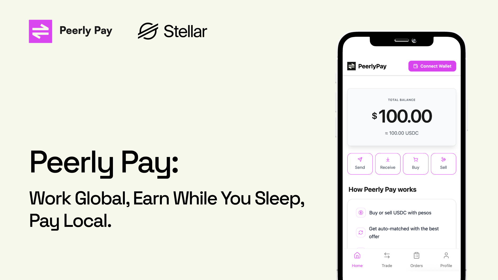

<div align="center">
  
  <br />
  <br />
  
  <h1>PeerlyPay 🌍💸</h1>
  <p><strong>Earn Global, Spend Local - Trustless ramp for the borderless economy.</strong></p>

  <p>
    
    
    
    
    
    
    
    
    
  </p>
</div>

## Tagline

**"Earn Global, Spend Local - Trustless ramp for the borderless economy."**

## Overview

PeerlyPay is a decentralized P2P fiat-to-crypto marketplace that lets users trade USDC for local fiat (and vice versa) without relying on centralized exchanges.

We built PeerlyPay for **remote workers, freelancers, and digital nomads** in emerging markets who earn in crypto but have local expenses. Instead of using KYC-heavy CEXs or risky OTC deals, PeerlyPay provides a **trustless ramp**: funds are secured in **Stellar Soroban** smart contracts, while dispute resolution is handled securely on **Base** via the Slice Protocol.

## Features

* ✅ **P2P Marketplace** for USDC ↔ Fiat trades
* ✅ **Non-custodial Escrow** powered by Stellar Soroban (Rust)
* ✅ **Cross-Chain Dispute Resolution** (Stellar ↔ Base bridge)
* ✅ **Real-time Order Management**
* ✅ **In-app Chat** for payment coordination
* ✅ **Mobile-first responsive design**
* ✅ **Multiple payment methods** (Bank Transfer, MercadoPago)

## Tech Stack

### Frontend

* **Next.js 16** (App Router)
* **TypeScript**
* **Tailwind CSS v4** (with `oklch` color spaces)
* **shadcn/ui** components
* **Zustand** (State Management)
* **Sonner** (Toast Notifications)

### Blockchain Architecture

* **Core Escrow & Payments:** Stellar Soroban (Rust)
* Handles fund locking, releasing, and state management.


* **Dispute Resolution:** Base (Solidity)
* Utilizes **Slice Protocol V1.5** for decentralized arbitration.


* **Bridge:** Custom Proxy Contract & Relayer
* Locks funds on Stellar to trigger arbitration on Base, then relays the ruling back.

## How to Run It

### Smart Contract

1. **Install the Stellar CLI**

   Follow the official instructions: https://developers.stellar.org/docs/tools/cli/install-cli

2. **Navigate to the contracts directory**

   ```bash
   cd contracts
   ```

3. **Create or import a Stellar account**

   ```bash
   stellar keys generate [name] --network testnet --fund
   ```

4. **Build the contract**

   ```bash
   stellar contract build
   ```

5. **Deploy the contract**

   ```bash
   stellar contract deploy \
     --wasm target/wasm32v1-none/release/p2p.wasm \
     --source-account [name] \
     --network testnet \
     --alias p2p
   ```

### Frontend

1. Complete the smart contract deployment steps above.
2. Get a Crossmint API key from https://www.crossmint.com/.
3. Copy `.env.example` to `.env` and fill in the required variables (contract address, API keys, etc.).
4. Install dependencies and start the dev server:

   ```bash
   pnpm install
   pnpm run dev
   ```

## How It Works

1. **Connect Wallet** – Link your Stellar wallet (and EVM wallet for dispute protection).
2. **Create/Match Order** – Users agree on terms; USDC is locked in a unique **Soroban Escrow Contract**.
3. **Off-chain Transfer** – Buyer sends fiat via Bank/MercadoPago.
4. **Completion** – Seller confirms receipt, and the contract releases USDC to the buyer.
5. **Dispute Flow (If needed)**:
* User triggers dispute on Stellar.
* Proxy relays request to **Base**.
* Jurors on Slice Protocol rule on the case.
* Ruling is bridged back to Stellar to unlock funds to the winner.


## Project Structure

```bash
peerlypay/
├── app/                    # Next.js 16 App Router
│   ├── orders/             # Marketplace, create, mine, and detail flows
│   │   ├── create/
│   │   ├── mine/
│   │   └── [id]/
│   └── profile/
├── components/             # Reusable shared components + shadcn/ui primitives
├── contracts/              # Smart Contracts Workspace
│   ├── .stellar/           # Soroban Network Configs
│   └── contracts/
│       └── escrow/         # Main Soroban Rust Contract
├── lib/                    # Utilities & Zustand Store
└── types/                  # TypeScript Interfaces

```

## Frontend Styling Conventions

* Prefer tokenized theme utilities over arbitrary values (for example `max-w-120` instead of `max-w-[480px]`).
* Use CSS variables in `app/globals.css` as the source of truth for custom colors, shadows, gradients, and spacing.
* Keep route-local components under `app/**`; put cross-route reusable components under `components/**`.
* Treat `components/ui/**` as shadcn/Radix primitives and avoid unnecessary churn unless behavior must change.

## Getting Started

### Prerequisites

* Node.js 18+
* [Stellar CLI](https://developers.stellar.org/docs/build/smart-contracts/getting-started/setup) (for contract interaction)
* Rust (wasm32-unknown-unknown target)

### Installation

1. **Clone the repo:**
```bash
git clone [repo-url]
cd peerlypay

```


2. **Install dependencies:**
```bash
npm install
# or
pnpm install

```


3. **Run the development server:**
```bash
npm run dev

```


4. **Run Contracts (Optional):**
Navigate to `contracts/` to build and test the Soroban logic.
```bash
cd contracts
cargo test

```

### P2P quick setup (wallets + deploy + seed)

From `contracts/`:

```bash
make p2p-wallet-setup NETWORK=testnet

make p2p-quickstart NETWORK=testnet
```

`p2p-wallet-setup` creates aliases, funds XLM, and sets trustlines. Then fund those wallets with USDC (or your selected token) before trading.

For frontend taker flow details (buy vs sell) and how to continue as market maker from CLI, see `contracts/README.md` under `P2P Contract -> Frontend taker flow and market-maker CLI continuation`.


## Future Roadmap

* [ ] Automated Relayer Service for Stellar <-> Base bridge
* [ ] Integration with Unibase for portable reputation
* [ ] AI Dispute Agent for pre-arbitration mediation
* [ ] Mobile App (React Native)

## Team

* **Alexis**
* **Steven**
* **Stefano**
* **Barb**

## License

MIT

---

*Built with ❤️ for Stellar 2026*
